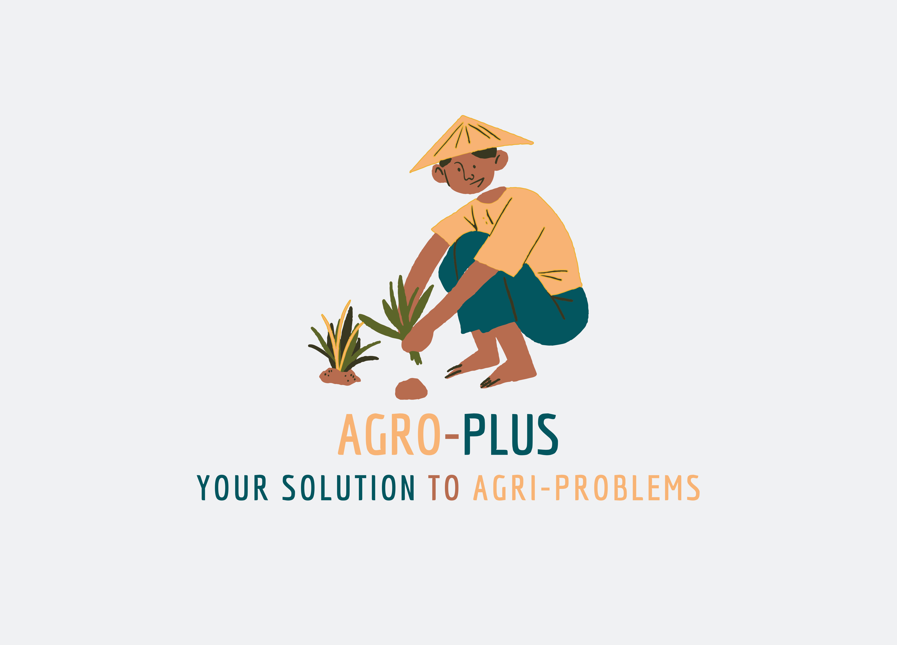

# AGRO-PLUS

> We the **TEAM EDISON** presents to you the app **AGRO-PLUS**. A platform where farmers can find out the disease of a crop by just taking a picture of the crop.

> We also provide you with a solution to cure the disease, the neccessary steps to be taken. We would be providing quality end-to-end support with the help of trained indivduals in this field.

> Currently we are at a stage where we could detect only  Brown rust & Yellow rust, which are a common disease seen among wheat crops.

> We train the disease detecting model by using **TENSORFLOW** & integrated it with our app made with **Flutter**.